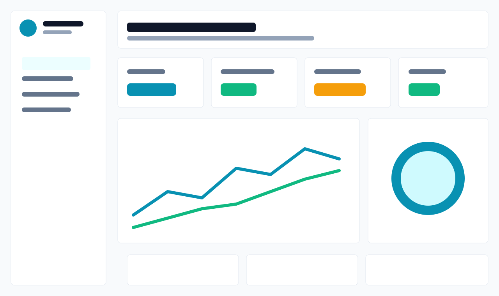

# Agentforce Onboarding Hub

Agentforce Onboarding Hub is a production-minded open-source SaaS platform for accelerating adoption, implementation quality, AI usage visibility, and ROI realization across Salesforce Agentforce programs.

It is designed for developers, admins, business analysts, support teams, operations teams, CIOs/CTOs, AI governance teams, executives, business leaders, and customer success teams.



## What it solves

- Slow Agentforce onboarding and unclear implementation roadmaps
- Lack of role-based enablement for technical and non-technical stakeholders
- Limited visibility into Agentforce usage, credit consumption, and ROI indicators
- Uncertainty around high-value AI use cases and rollout sequencing
- Inconsistent governance, prompt reuse, and stakeholder communication

## Core features

- Role-based onboarding journeys for developers, admins, analysts, executives, support, and governance teams
- Interactive readiness assessment with score, complexity, quick wins, risks, and rollout strategy
- AI use case generator by industry, segment, team size, business function, and Salesforce products
- Credit consumption dashboard with team usage, cost projections, high-consumption workflows, and optimization recommendations
- Reusable prompt library for support, sales, onboarding, service operations, business analysis, escalation, and communications
- Implementation accelerator with stages, sandbox guidance, governance, AI security, and rollout planning
- Team adoption tracker and executive dashboard
- Knowledge hub with concepts, best practices, FAQs, troubleshooting, and sample workflows
- Industry templates for SaaS, retail, healthcare, financial services, manufacturing, support organizations, and SMB service teams
- Integration stubs for GitHub OAuth, Salesforce OAuth, Slack, Jira, Supabase, and OpenAI

## Tech stack

- Frontend: Next.js 15, TypeScript, TailwindCSS, shadcn/ui-style primitives
- Backend: Node.js API routes with Express
- Database: Supabase/PostgreSQL
- Auth: GitHub OAuth and Salesforce OAuth stubs
- AI: OpenAI API adapter plus deterministic fallback recommendation engine
- Charts: Recharts
- State: Zustand
- Monorepo: Turborepo and pnpm workspaces
- Delivery: Docker Compose and GitHub Actions

## Repository structure

```text
apps/
  web/                Next.js 15 dashboard and onboarding experience
  api/                Node.js REST API and integration boundary
packages/
  ui/                 Reusable shadcn-style UI primitives
  ai-engine/          Use-case and onboarding plan generation
  checklist-engine/   Role journeys, templates, readiness scoring
  prompt-library/     Curated prompt templates
  analytics/          Credit, adoption, and ROI calculations
supabase/
  schema.sql          PostgreSQL schema
  seed.sql            Demo organizations, prompts, and usage data
docs/
  architecture.md     Architecture diagrams and boundaries
  api.md              API reference
  deployment.md       Deployment guide
```

## Quick start

```bash
corepack enable
pnpm install
cp .env.example .env
pnpm dev
```

Open the web app at `http://localhost:3000` and the API health check at `http://localhost:4000/health`.

## Docker

```bash
cp .env.example .env
docker compose up --build
```

Docker Compose starts PostgreSQL, the API on port `4000`, and the web app on port `3000`.

## Deploy web app to Vercel

This repository includes `vercel.json` for the monorepo web app.

Use these Vercel settings:

- Framework Preset: `Next.js`
- Root Directory: repository root
- Install Command: `corepack enable && pnpm install --frozen-lockfile`
- Build Command: `pnpm --filter @agentforce/web build`
- Output Directory: `apps/web/.next`

Do not set the output directory to `public`; this is a Next.js app, so Vercel should deploy the generated `.next` output.

## Useful scripts

```bash
pnpm dev          # Start all apps in development mode
pnpm build        # Build the monorepo
pnpm lint         # Run lint/type validation tasks
pnpm typecheck    # Type-check all workspaces
pnpm db:seed      # Load schema and seed data into DATABASE_URL
```

## Environment variables

Use `.env.example` as the source of truth. The app runs with realistic local data without external keys, but production deployments should configure:

- `NEXT_PUBLIC_SUPABASE_URL`
- `NEXT_PUBLIC_SUPABASE_ANON_KEY`
- `SUPABASE_SERVICE_ROLE_KEY`
- `OPENAI_API_KEY`
- `GITHUB_CLIENT_ID` and `GITHUB_CLIENT_SECRET`
- `SALESFORCE_CLIENT_ID` and `SALESFORCE_CLIENT_SECRET`
- Optional Slack and Jira credentials

## API examples

```bash
curl http://localhost:4000/api/journeys
curl http://localhost:4000/api/prompts
curl -X POST http://localhost:4000/api/readiness \
  -H "content-type: application/json" \
  -d '{"salesforceMaturity":4,"supportProcessMaturity":3,"aiReadiness":3,"dataQuality":4,"automationMaturity":3,"crmWorkflowCoverage":3,"knowledgeBaseReadiness":3}'
```

See [docs/api.md](docs/api.md) for the full API reference.

## Production notes

Before running in production, enable Supabase row-level security, configure OAuth callback allowlists, add API rate limiting, wire structured logging, rotate secrets, and review AI-generated onboarding plans before distribution.

## Contributing

Read [CONTRIBUTING.md](CONTRIBUTING.md) for workflow, standards, and contribution areas. The project is MIT licensed.
