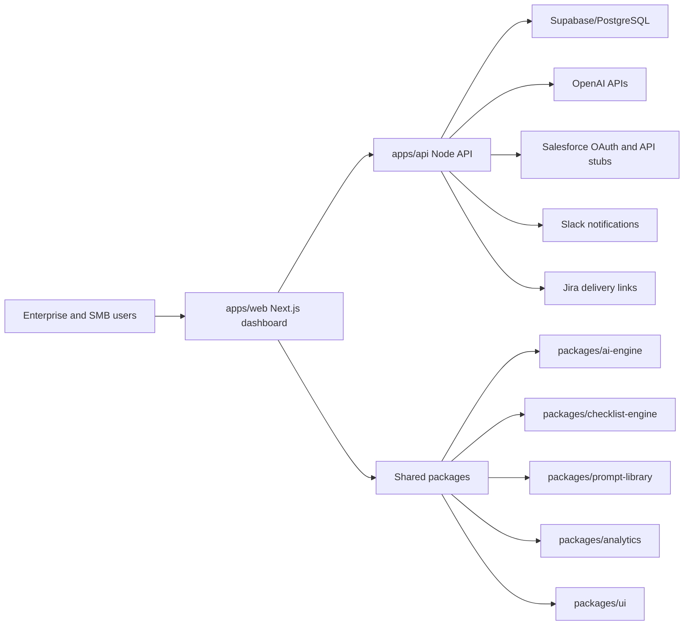

# Architecture

Agentforce Onboarding Hub is a Turborepo monorepo with independently deployable web and API applications plus reusable domain packages.

## Boundaries

- `apps/web`: Product experience, analytics dashboards, onboarding wizard, client state.
- `apps/api`: REST endpoints, integration adapters, auth callback stubs, persistence boundary.
- `packages/ui`: Accessible reusable primitives inspired by shadcn/ui conventions.
- `packages/checklist-engine`: Role journeys, readiness scoring, implementation stages.
- `packages/ai-engine`: Use case generation, onboarding plan generation, OpenAI adapter.
- `packages/prompt-library`: Curated reusable Agentforce prompt templates.
- `packages/analytics`: Credit, ROI, adoption, and productivity calculations.

## Data flow

1. Organization profile and role selections are captured in the web onboarding wizard.
2. The checklist engine calculates readiness, milestones, and risk areas.
3. The AI engine recommends use cases and can call OpenAI when configured.
4. The analytics package estimates Agentforce credit usage and ROI indicators.
5. The API persists organizations, assessments, prompts, journeys, and usage snapshots in PostgreSQL.

## Deployment model

The monorepo supports local Docker Compose, Vercel plus managed API hosting, or a single container image for internal demos. Production deployments should use managed PostgreSQL/Supabase, secret rotation, OAuth callback allowlists, and row-level security.
